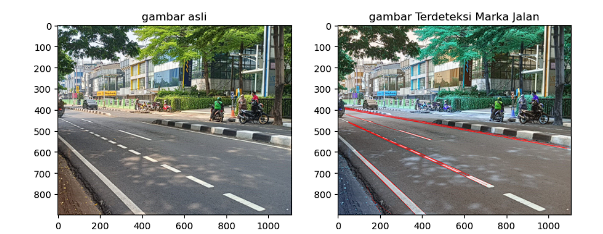

# Deteksi Marka Jalan
Sebuah Project Pendeteksi Marka Jalan yang dibuat dalam Jupyter Notebook



## Teori Pendukung
Dengan perkembangan komputer dan alat pengambilan gambar secara digital yang semakin berkembang saat ini, sehingga menghasilkan banyak fasilitas untuk melakukan proses pengolahan gambar agar lebih sesuai dengan kebutuhan. Salah satunya adalah deteksi tepi (Edge Detection), karena dengan menggunakan proses deteksi tepi gambar makaproses pengolahan manipulasi pada gambar akan lebih mudah dilakukan.

Edge Detection merupakan suatu metode untuk mengetahui lokasi dari marka jalan tanpa diketahui terlebih dahulu noise yang terdapat pada lingkungan sekitarnya. Deteksi tepi merupakan salah satu operasi dasar dari pemrosesan citra. Tepi merupakan batas dari suatu objek. Pada proses klasifikasi citra, deteksi tepi sangat diperlukan sebelum pemrosesan segmentasi citra. Batas objek suatu citra dapat dideteksi dari perbedaan tingkat keabuannya (Purnomo dan Muntasa, 2010). Untuk itu saya memilih metode Edge Detection untuk melakukan Deteksi Marka jalan. 

Tujuan yang didapatkan dari projek peneliatian ini yaitu, Edge Detection ini dapat menjadi salah satu
pendukung driver assistant maupun untuk autonomous navigation yang termasuk bagian dari inteligent transportation system.  Contohnya adalah sulitnya menentukan marka jalannya pada berbagai kondisi, terutama terhadap noise yang ada di lingkungan sekitarnya, seperti bayangan, garis-garis lain yang terdapat pada jalan, dan juga marka jalan yang sudah tidak utuh lagi atau marka jalan yang terputus-putus.  


## Tahapan Project

Terdapat beberapa tahapan dalam melakukan Deteksi Tepi Garis, beberapa metode yang saya pakai: 

- Pemrosesan Citra : Pemrosesan citra digunakan untuk mengubah gambar asli menjadi representasi yang lebih cocok untuk analisis lebih lanjut. Dalam tahapan ini saya melakukan konversi gambar ke skala keabuan
- Deteksi Tepi : Deteksi tepi digunakan untuk menemukan perubahan tajam dalam intensitas piksel pada gambar. Metode operator Canny, saya pilih untuk digunakan mengidentifikasi tepi pada gambar.
- Region Masking : Region Masking Berguna untuk memilih daerah yang akan di deteksi bagian marka jalan. Digunakan dengan Membuat shape yang sesuai dengan marka jalan yang akan diambil.
- Line Displaying : Tahapan ini merupakan tahapan akhir dari Project ini, Dilakukan dengan menanpilkan line yang sudah didapat dari tahapan sebelumnya lalu menampilkannya pada gambar.


## Penjelasan Kode

#### Import Library
```bash
import cv2 
import numpy as np
import matplotlib.pyplot as plt
%matplotlib inline 
from skimage.io import imread
```
mengimport library yang dibutuhkan dalam projek ini berupa cv2, numpy dan matplotlib lalu function imread. OpenCV digunakan untuk manipulasi gambar dan video, NumPy untuk operasi pada array multidimensi, dan Matplotlib untuk menampilkan gambar dan plot data.

#### Menampilkan Gambar Awal
```bash
img = imread(fname="img/jalanan.jpg")
plt.imshow(img)
```
Mengimport gambar ke dalam variabel "img" lalu menampilkannya secara inline dengan plt

#### Menampilkan Tepi Gambar
```bash
gray = cv2.cvtColor(img, cv2.COLOR_BGR2GRAY)

#canny untuk mendeteksi tepi
edges = cv2.Canny(img, 230, 300)

fig, axs = plt.subplots(1,2, figsize =(10,10))
ax = axs.ravel()

#Tampilan Asli
ax[0].imshow(gray, cmap='gray')
ax[0].set_title('gambar asli')

#Tampilan Edges
ax[1].imshow(edges, cmap='gray')
ax[1].set_title('gambar hanya tepi garis')
```
Kode diatas menggunakan library OpenCV untuk mengubah gambar menjadi citra skala abu-abu dan untuk mendeteksi tepi pada gambar menggunakan metode Canny. lalu membuat axs untuk menampilkan gambar gray biasa dengan gambar yang telah di deteksi tepi garis nya.

#### Mengisolate Gambar
```bash
height, width = edges.shape
#mengisolasi bagian gambar yang ingin di berikan edges
triangle = np.array([
                    [(200, 1000), (30, 390), (width, 580)]
                    ])

mask = np.zeros_like(edges)
#membuat masking (segitiga untuk daerah yang dipilih untuk masking)
mask = cv2.fillPoly(mask, triangle, 255)
isolated = cv2.bitwise_and(edges, mask)

fig, axs = plt.subplots(1,2, figsize =(10,10))
ax = axs.ravel()

#Tampilan Asli
ax[0].imshow(edges, cmap='gray')
ax[0].set_title('tepi asli')

#Tampilan after Isolation
ax[1].imshow(isolated, cmap='gray')
ax[1].set_title('tepi setelah di isolasi')
```
Di kode atas, dilakukan beberapa langkah untuk memanipulasi citra tepi (edges).ukuran citra tepi diambil menggunakan .shape, kemudian sebuah segitiga didefinisikan dan digunakan sebagai masker. Masker tersebut diisi dengan 255 menggunakan cv2.fillPoly dan diaplikasikan ke citra tepi menggunakan operasi bitwise cv2.bitwise_and, sehingga menghasilkan citra tepi yang hanya mempertahankan bagian yang berada di dalam segitiga tersebut. Hasil akhirnya disimpan dalam variabel isolated. lalu menampilkan dalam bentuk plt

#### Mendeteksi Marka Jalan
```bash
lines = cv2.HoughLinesP(isolated, 1, np.pi/180, threshold=25 ,minLineLength=5, maxLineGap=200)
img_line = img.copy()
```
fungsi cv2.HoughLinesP digunakan untuk mendeteksi garis pada citra isolated dengan menggunakan metode Hough Transform. Parameter-parameter yang digunakan adalah resolusi piksel 1, sudut resolusi 1 derajat, threshold deteksi 25, panjang garis minimal 5 piksel, dan jarak maksimal antara piksel garis 200 piksel. Hasilnya disimpan dalam variabel lines. Kemudian, citra asli img disalin ke variabel img_line dan akan digunakan untuk menggambar garis yang dideteksi.
```bash
for line in lines:
    x1, y1, x2, y2, = line[0]
    cv2.line(img_line, (x1,y1), (x2,y2), (0,0,255), 1)

#(x1,y1) = sudut kiri atas garis
#(x2,y2) = sudut kanan bawah garis
```
sebuah loop yang digunakan untuk menggambar garis-garis yang dideteksi oleh fungsi HoughLinesP pada citra img_line. Pada setiap iterasi, koordinat titik awal dan titik akhir garis (x1, y1, x2, y2) diekstraksi dari array line yang didapat dari variabel lines. Garis tersebut kemudian digambar pada citra img_line menggunakan fungsi cv2.line, dengan warna merah (0,0,255) dan lebar garis 1.

```bash
img_after = cv2.cvtColor(img_line, cv2.COLOR_BGR2RGB)

#Tampiln menggunakan index
fig, axs = plt.subplots(1,2, figsize = (10,10))
ax = axs.ravel()

#Tampilan Asli
ax[0].imshow(img)
ax[0].set_title('gambar asli')

#Tampilan Akhir
ax[1].imshow(img_after)
ax[1].set_title('gambar Terdeteksi Marka Jalan')
```
Terakhir, mengkonversi ke rgb dari gambar bgr dengan func func cvtColor. lalu, kita akan menampilkan gambar di awal dan gambar hasil dari proses yang telah di lalui deteksi marka jalan
## Jurnal Terkait

- Sukatmi, S. (2017). Perbandingan deteksi Tepi citra digital Dengan Menggunakan metode Prewitt, Sobel Dan Canny. KOPERTIP : Jurnal Ilmiah Manajemen Informatika Dan Komputer, 1(1), 1–4. https://doi.org/10.32485/kopertip.v1i1.3 

